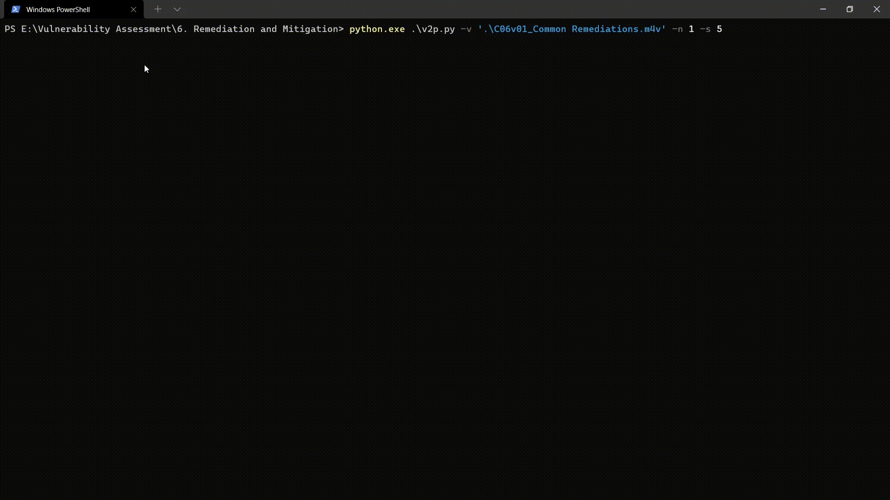

# AiMi-V2P-Video-to-PDF-Converter

I created this script specifically for students/professionals who are doing online courses. I suffered a lot sitting in front of the screen for hours watching the video, so I thought why not convert this video into a book of slides. Because mostly online platforms/lecture videos contain slides. So converting the video into individual slides helped me a lot.

* Written in Python3
* Uses OpenCV
* The tool only extracts unique slides in one direction (forward) even if the lecture/video is for 2-3 hours long using Pixel Difference
* You can fully customize the script
* Still need lot of improvements

# Demo



# Usage

* You need - OpenCv, re, moviepy, optparse, scikit, matplotlib, numpy, reprint modules 

```python -v 'video.mp4' -s 5 -n 1```

* Copy the script into your videos folder or provide the full path of the video
* The ```-v``` option gets the video name
* The ```-s``` option tells the script to jump to every nth second into the video. Ex: If given as 5, then script jumps as follows 5,10,15,20,25...and so on until the end
* The ```-n``` option get the video number. The video number here is to avoid mixing of images. So in case if you are converting multiple videos to PDF which are in the "same folder" then give different Video number so that the images are easily differentiated. In case if you are only convreting only "one video" at a time then give the number as just "1"
* The output will be a PDF with the same name as the video
* The very downside is that you need to initially add a simple screenshot from a video you are going to convert. There is a issue with the image dimensions. So, if you are going to work with multiple videos of same dimension then one single image is enough to add as a test image. If you are going to convert multiple videos of different dimensions then you are going to add different test images inside the script
* So overall you need to add one test image inside the script(you will be able to find it inside the script) before running the script. DO NOT FORGET

# To Do

* Find a work around for "test" image issue
* Capture unique slides in both directions
* If possible increase the performance
* More user friendly and custom options

# NOTE: Always open to suggestions, bugs, mistakes, improvements. 
